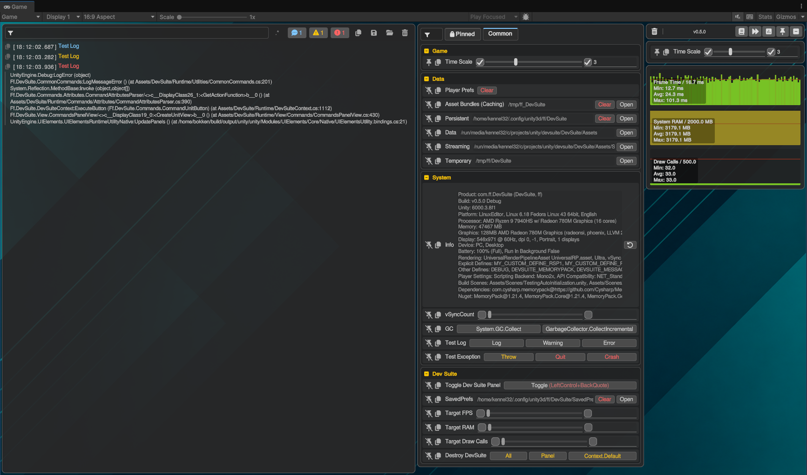
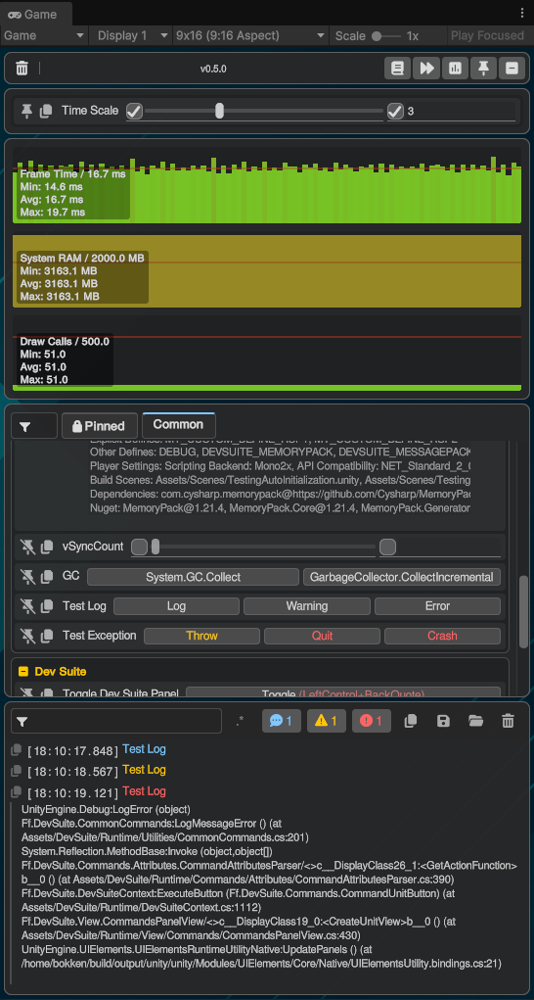
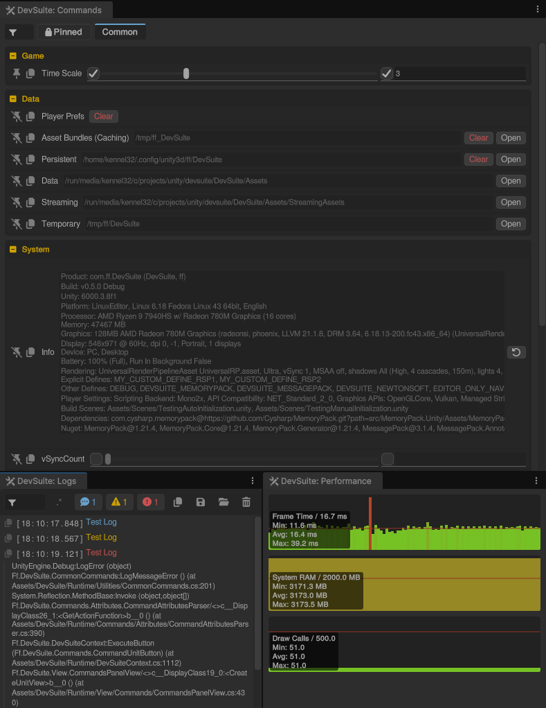

# DevSuite for Unity

[](https://unity.com/)
[](LICENSE)
[](https://github.com/fairfun/devsuite-for-unity/stargazers)

**DevSuite** is a powerful collection of custom editor and runtime tools designed to streamline the debugging and troubleshooting process in Unity. It provides a flexible and extensible framework for managing commands, monitoring performance, and viewing logs directly within your application or the Unity Editor.

## Screenshots

<table style="border-collapse: collapse; width: 100%;">
  <thead>
    <tr>
      <th align="left" style="background-color: #88888855; color: #ffffff; padding: 10px; border: 1px solid #88888855;">🎬 Showcase</th>
      <th align="left" style="background-color: #88888855; color: #ffffff; padding: 10px; border: 1px solid #88888855;">🖥️ Landscape</th>
      <th align="left" style="background-color: #88888855; color: #ffffff; padding: 10px; border: 1px solid #88888855;">📱 Portrait</th>
      <th align="left" style="background-color: #88888855; color: #ffffff; padding: 10px; border: 1px solid #88888855;">⚙️ Editor Windows</th>
    </tr>
  </thead>
  <tbody>
    <tr valign="top">
      <td style="padding: 10px; border: 1px solid #d0d7de;"></td>
      <td style="padding: 10px; border: 1px solid #d0d7de;"></td>
      <td style="padding: 10px; border: 1px solid #d0d7de;"></td>
      <td style="padding: 10px; border: 1px solid #d0d7de;"></td>
    </tr>
  </tbody>
</table>

## Features
- ⚡ **Simple but Powerful**: A robust toolkit that is easy to set up yet highly extensible.
- 🆓 **Free & Open-Source**: 100% free and open-source, released under the MIT License for use in personal and commercial projects.
- 🧩 **Flexible Integration**: Easy to set up and integrate into existing projects with minimal overhead.
- 🌐 **Cross-Platform**: Supports running in the Editor, as well as Desktop, Mobile, and WebGL builds.
- 📱 **Responsive Design**: Modern UI Toolkit-based interface that works seamlessly across different screen sizes.
- 🏷️ **Commands with Extensive Attributes**: Highly customizable through attributes, allowing you to expose commands and data with minimal code.
- 📊 **Performance Monitor**: Integrated graphs and statistics for real-time performance tracking (FPS, memory, etc.), can add your own custom stats too.
- 📜 **Logs Panel**: Full-featured in-game console for viewing and filtering system logs, saving logs to a file.
- 📌 **Pinned Commands**: A dedicated panel for your most frequently used actions for quick access.
- 🌳 **Hierarchy Panel**: Browse the live scene hierarchy at runtime — search, filter, select, toggle active state, and copy the full tree as text.
- 🔍 **Inspector Panel**: Inspect selected GameObjects at runtime — view all components, toggle MonoBehaviour enabled state, and copy all property values to clipboard.
- 🔄 **Data Handling**: Support for custom data adapters and providers.
- ✨ **Quality of Life**:
  - 🗂️ **Organization**: Advanced filtering, pinning system, and category tabs.
  - 💾 **Persistent Properties**: Integrated <a href="DevSuite/Assets/DevSuite/Runtime/Prefs/SavedPrefsProperty.cs"><code>SavedPrefsProperty&lt;T&gt;</code></a> for properties that automatically save and load their values from preferences with change tracking.
  - ⏱️ **Efficiency**: Button shortcuts and a predefined set of common utility commands.
  - 🎨 **Customization**: Customizable colors, titles, tooltips, item height, scale type for sliders, and more.
  - 🔌 **Dynamic Registration**: Register and unregister commands at runtime for both static classes and specific class instances.
  - 🤝 **Unified Experience**: Identical look and feel between Editor Windows and Runtime UI.
- 🚀 **Fast Play Mode Ready**: Optimized for Unity's fast play mode to minimize iteration times.

## Requirements

- **Minimum Tested Unity Version**: `2022.3.62`
- **Dependencies**: UI Toolkit (Standard in Unity 2022.3+)
- **Serialization (Recommended)**: It is strongly recommended to have one of the following packages installed for optimal functionality:
  - [MemoryPack](https://github.com/Cysharp/MemoryPack)
  - [MessagePack](https://github.com/MessagePack-CSharp/MessagePack-CSharp)
  - [Newtonsoft.Json for Unity](https://docs.unity3d.com/Packages/com.unity.nuget.newtonsoft-json@3.2/manual/index.html)

## Installation

### Via Git URL (UPM)

1. Open the **Package Manager** in Unity (`Window > Package Manager`).
2. Click the `+` button in the top-left corner and select **Add package from git URL...**.
3. Enter the repository URL:
   ```text
   https://github.com/fairfun/devsuite-for-unity.git?path=DevSuite/Assets/DevSuite
   ```
   To pin a specific version, append the tag (e.g. `#0.1.1`):
   ```text
   https://github.com/fairfun/devsuite-for-unity.git?path=DevSuite/Assets/DevSuite#0.1.1
   ```
## Getting Started

There are several ways to use DevSuite depending on your needs:

### 1. Runtime UI (Simplest)
Add an instance of <a href="DevSuite/Assets/DevSuite/Runtime/DevSuitePanel.prefab"><code>DevSuitePanel.prefab</code></a> to your scene. This automatically initializes the suite and provides an overlay to access all tools during gameplay, as long as <strong>Auto Initialize</strong> is set to true. Some panel settings are available under the <strong>Settings</strong> section of the prefab instance.

Open the example scene [`DevSuite/Assets/DevSuite/Examples/ExampleAutoInitialization.unity`](DevSuite/Assets/DevSuite/Examples/ExampleAutoInitialization.unity) to see this setup in action.

### 2. Editor Windows
You can open individual DevSuite tools directly in the Unity Editor without entering Play Mode:
- Go to **Tools > DevSuite** and select the desired panel (Commands, Logs, Performance, or Pins).

### 3. Manual Code Initialization
For more control, you can initialize the <a href="DevSuite/Assets/DevSuite/Runtime/DevSuiteContext.cs"><code>DevSuiteContext</code></a> manually in your code:

```csharp
using Ff.DevSuite;
using UnityEngine;

public class MyGameInitializer : MonoBehaviour
{
    void Awake()
    {
        // Initialize with this MonoBehaviour as the coroutine runner
        DevSuiteContext.Default.Initialize(this);
    }
}
```

Open the example scene [`DevSuite/Assets/DevSuite/Examples/ExampleManualInitialization.unity`](DevSuite/Assets/DevSuite/Examples/ExampleManualInitialization.unity) to see this setup in action.

Refer to the documentation or sample scenes for more detailed configuration and advanced usage.

## Usage

<h3 align="center">📋 Setup</h3>

<table style="border-collapse: collapse; width: 100%;">
  <thead>
    <tr>
      <th align="left" style="background-color: #88888855; color: #ffffff; padding: 10px; border: 1px solid #88888855;">🚀 Initialization</th>
      <th align="left" style="background-color: #88888855; color: #ffffff; padding: 10px; border: 1px solid #88888855;">💾 Serialization Options</th>
      <th align="left" style="background-color: #88888855; color: #ffffff; padding: 10px; border: 1px solid #88888855;">⚙️ Modifying CommonCommands</th>
    </tr>
  </thead>
  <tbody>
    <tr valign="top">
      <td style="padding: 10px; border: 1px solid #88888855; width: 33%;">
        <p><strong>Automatic (prefab)</strong></p>
        <p>Add <a href="DevSuite/Assets/DevSuite/Runtime/DevSuitePanel.prefab"><code>DevSuitePanel.prefab</code></a> to a scene. <a href="DevSuite/Assets/DevSuite/Runtime/View/Panel/DevSuitePanelUI.cs"><code>DevSuitePanelUI</code></a> calls <a href="DevSuite/Assets/DevSuite/Runtime/DevSuiteContext.cs"><code>DevSuiteContext.Default.Initialize(this)</code></a> on Start when <strong>Auto Initialize</strong> is enabled.</p>
        <p>See example scene: <a href="DevSuite/Assets/DevSuite/Examples/ExampleAutoInitialization.unity"><code>ExampleAutoInitialization.unity</code></a></p>
        <p><strong>Manual</strong></p>
        <p>Call <a href="DevSuite/Assets/DevSuite/Runtime/DevSuiteContext.cs"><code>DevSuiteContext.Default.Initialize(monoBehaviour)</code></a> from your bootstrap code (e.g. <code>Awake</code>). Optional arguments:</p>
        <ul>
          <li><code>staticCommandsAssemblies</code> — limit command scanning to specific assemblies</li>
          <li><code>savedPrefs</code> — custom <a href="DevSuite/Assets/DevSuite/Runtime/Prefs/SavedPrefs.cs"><code>ISavedPrefs</code></a> for panel/settings persistence</li>
          <li><code>registerCommonCommands: false</code> — skip built-in <a href="DevSuite/Assets/DevSuite/Runtime/Utilities/CommonCommands.cs"><code>CommonCommands</code></a></li>
          <li><code>DevSuiteContext.Default</code> — override the version string shown in the UI (default: <code>"v" + Application.version</code>) — see <a href="DevSuite/Assets/DevSuite/Runtime/DevSuiteContext.cs"><code>DevSuiteContext.cs</code></a></li>
        </ul>
        <p>See example scene: <a href="DevSuite/Assets/DevSuite/Examples/ExampleManualInitialization.unity"><code>ExampleManualInitialization.unity</code></a></p>
        <p><strong>Editor</strong></p>
        <p>Open panels via <strong>Tools &gt; DevSuite</strong>; the context initializes automatically when you enter Play Mode.</p>
        <p><strong>Runtime registration</strong></p>
        <p>After init, use <a href="DevSuite/Assets/DevSuite/Runtime/Commands/Attributes/CommandAttributesParser.cs"><code>AttributesParser.RegisterStatic(type)</code></a> or <a href="DevSuite/Assets/DevSuite/Runtime/Commands/Attributes/CommandAttributesParser.cs"><code>AttributesParser.RegisterInstance(object)</code></a> to add commands dynamically.</p>
      </td>
      <td style="padding: 10px; border: 1px solid #88888855; width: 33%;">
        <p>DevSuite uses <a href="DevSuite/Assets/DevSuite/Runtime/Prefs/SavedPrefs.cs"><code>SavedPrefs</code></a> for persistent settings (<a href="DevSuite/Assets/DevSuite/Runtime/Prefs/SavedPrefsProperty.cs"><code>SavedPrefsProperty&lt;T&gt;</code></a>, panel state). The serializer is selected automatically based on installed packages (via <code>DevSuite.asmdef</code> <code>versionDefines</code>):</p>
        <ul>
          <li><a href="https://github.com/Cysharp/MemoryPack"><strong>MemoryPack</strong></a> (<code>DEVSUITE_MEMORYPACK</code>) — preferred when installed; fastest binary format</li>
          <li><a href="https://github.com/MessagePack-CSharp/MessagePack-CSharp"><strong>MessagePack</strong></a> (<code>DEVSUITE_MESSAGEPACK</code>) — binary alternative</li>
          <li><a href="https://docs.unity3d.com/Packages/com.unity.nuget.newtonsoft-json@3.2/manual/index.html"><strong>Newtonsoft.Json</strong></a> (<code>DEVSUITE_NEWTONSOFT</code>) — JSON via <a href="DevSuite/Assets/DevSuite/Runtime/Prefs/JsonSavedPrefs.cs"><code>JsonSavedPrefs</code></a></li>
        </ul>
        <p>If multiple packages are present, <strong>MemoryPack</strong> takes priority, then MessagePack, then Newtonsoft.</p>
        <p><strong>If needed, override the backend:</strong> <code><a href="DevSuite/Assets/DevSuite/Runtime/Prefs/SavedPrefs.cs">SavedPrefs</a>.Factory = name =&gt; new <a href="DevSuite/Assets/DevSuite/Runtime/Prefs/MemoryPackSavedPrefs.cs">MemoryPackSavedPrefs</a>(name);</code></p>
        <p><strong>Custom serialization:</strong> <code>savedPrefs.SetSerializer(serialize, deserialize)</code></p>
        <p><strong>No serializer package:</strong> Falls back to <a href="DevSuite/Assets/DevSuite/Runtime/Prefs/FallbackSavedPrefs.cs"><code>FallbackSavedPrefs</code></a> (in-memory only; settings are not persisted).</p>
      </td>
      <td style="padding: 10px; border: 1px solid #88888855; width: 33%;">
        <p><a href="DevSuite/Assets/DevSuite/Runtime/Utilities/CommonCommands.cs"><code>CommonCommands</code></a> is a built-in static command set (Game, Data, System, Dev Suite categories) registered automatically unless <code>registerCommonCommands: false</code> is passed to <code>Initialize()</code>.</p>
        <p><strong>Customize without editing source</strong></p>
        <ul>
          <li><code>CommonCommands.ModifySystemInfo</code> — transform the System Info text block</li>
          <li><code>CommonCommands.CustomSystemInfoBuildTimeData</code> — append custom build-time lines</li>
        </ul>
        <p><strong>Extend or replace</strong></p>
        <p>Add your own <code>[CommandCategory]</code> classes, or fork/edit <a href="DevSuite/Assets/DevSuite/Runtime/Utilities/CommonCommands.cs"><code>CommonCommands.cs</code></a> directly. Many entries use <a href="DevSuite/Assets/DevSuite/Runtime/Prefs/SavedPrefsProperty.cs"><code>SavedPrefsProperty&lt;T&gt;</code></a> so values persist across sessions.</p>
      </td>
    </tr>
  </tbody>
</table>

<h3 align="center">🛠️ Make it your own</h3>

<table style="border-collapse: collapse; width: 100%;">
  <thead>
    <tr>
      <th align="left" style="background-color: #88888855; color: #ffffff; padding: 10px; border: 1px solid #88888855;">🏷️ Command Attributes</th>
      <th align="left" style="background-color: #88888855; color: #ffffff; padding: 10px; border: 1px solid #88888855;">🔌 Registering Adapters &amp; Providers</th>
      <th align="left" style="background-color: #88888855; color: #ffffff; padding: 10px; border: 1px solid #88888855;">📊 Performance Graphs</th>
    </tr>
  </thead>
  <tbody>
    <tr valign="top">
      <td style="padding: 10px; border: 1px solid #88888855; width: 33%;">
        <p>Commands are declared with attributes on static or instance members and discovered at initialization.</p>
        <p><strong>Hierarchy</strong></p>
        <p><a href="DevSuite/Assets/DevSuite/Runtime/Commands/Attributes/CommandCategoryAttribute.cs"><code>[CommandCategory]</code></a> → <a href="DevSuite/Assets/DevSuite/Runtime/Commands/Attributes/CommandGroupAttribute.cs"><code>[CommandGroup]</code></a> → <a href="DevSuite/Assets/DevSuite/Runtime/Commands/Attributes/CommandAttribute.cs"><code>[Command]</code></a> → <a href="DevSuite/Assets/DevSuite/Runtime/Commands/Attributes/CommandUnitAttribute.cs"><code>[CommandValue]</code></a> / <a href="DevSuite/Assets/DevSuite/Runtime/Commands/Attributes/CommandUnitAttribute.cs"><code>[CommandButton]</code></a></p>
        <p><strong>Common attributes</strong></p>
        <ul>
          <li><code>[CommandCategory]</code> / <code>[CommandGroup]</code> — organization, colors, descriptions, collapse state, visibility functions</li>
          <li><code>[Command]</code> — <code>DisplayName</code>, <code>HeightMultiplier</code>, <code>AlwaysPin</code>, <code>VisibilityFunctionName</code></li>
          <li><code>[CommandValue]</code> — fields, properties, methods; supports <code>MinValue</code>/<code>MaxValue</code>, <code>ScaleType</code>, <code>ReadOnly</code>, <code>PossibleValuesFunctionName</code>, <code>ForceStringRepresentation</code>, <code>Flex</code>, <code>Color</code>, <code>FontResource</code></li>
          <li><code>[CommandButton]</code> — action buttons; supports <code>Title</code>, <code>Shortcut</code>, <code>CommandId</code> to attach to an existing command row</li>
        </ul>
        <p>See <a href="DevSuite/Assets/DevSuite/Runtime/Commands/Attributes/CommandUnitAttribute.cs"><code>BaseCommandAttribute</code></a> subclasses for the full set of properties.</p>
      </td>
      <td style="padding: 10px; border: 1px solid #88888855; width: 33%;">
        <p>Extend how command values are displayed, edited, and populated.</p>
        <p><strong>Adapters</strong> — convert between custom types and their UI string representation:</p>
        <p><code><a href="DevSuite/Assets/DevSuite/Runtime/DevSuiteCommandsApi.cs">CommandsApi</a>.RegisterAdapter(new <a href="DevSuite/Assets/DevSuite/Runtime/Commands/Api/CommandValueAdapter.cs">DelegateCommandValueAdapterToString&lt;MyType&gt;</a>(toString, fromString));</code></p>
        <p><strong>Values providers</strong> — supply dropdown lists for a type:</p>
        <p><code><a href="DevSuite/Assets/DevSuite/Runtime/DevSuiteCommandsApi.cs">CommandsApi</a>.RegisterValuesProvider(new <a href="DevSuite/Assets/DevSuite/Runtime/Commands/Api/CommandValuesProvider.cs">CommandValuesProvider</a>(typeof(MyType), _ =&gt; myValues));</code></p>
        <p><strong>Functions providers</strong> — expose static/instance methods (e.g. for <code>VisibilityFunctionName</code>) from external types:</p>
        <p><code><a href="DevSuite/Assets/DevSuite/Runtime/DevSuiteCommandsApi.cs">CommandsApi</a>.RegisterTargetForFunctionsProvider(new <a href="DevSuite/Assets/DevSuite/Runtime/Commands/Api/CommandFunctionsSourceProvider.cs">CommandFunctionsSourceProvider</a>(typeof(MyClass)));</code></p>
        <p>Default adapters and an enum values provider are registered automatically during initialization.</p>
      </td>
      <td style="padding: 10px; border: 1px solid #88888855; width: 33%;">
        <p><strong>Built-in graphs:</strong> Frame Time, System RAM, Draw Calls (registered in <a href="DevSuite/Assets/DevSuite/Runtime/DevSuiteContext.cs"><code>DevSuiteContext.Initialize</code></a>).</p>
        <p><strong>Add a custom graph</strong></p>
        <ol>
          <li>Subclass <a href="DevSuite/Assets/DevSuite/Runtime/View/Performance/BaseGraphDataProvider.cs"><code>BaseGraphDataProvider</code></a></li>
          <li>Implement <code>GetCurrentValue()</code>, <code>Label</code>, and <code>UnitName</code></li>
          <li>Optionally set <code>ReferenceValueProvider</code> for a threshold/reference line</li>
          <li>Call <code>RegisterPerformancePanelGraph(new <a href="DevSuite/Assets/DevSuite/Runtime/View/Performance/BaseGraphDataProvider.cs">MyGraphDataProvider</a>())</code></li>
        </ol>
        <p><strong>Change thresholds for existing graphs</strong></p>
        <p>Use <code>SetPerformanceReferenceValue&lt;T&gt;(() =&gt; threshold)</code> where <code>T</code> is the provider type (e.g. <a href="DevSuite/Assets/DevSuite/Runtime/View/Performance/Providers/SystemRamGraphDataProvider.cs"><code>SystemRamGraphDataProvider</code></a>, <a href="DevSuite/Assets/DevSuite/Runtime/View/Performance/Providers/DrawCallsCountDataProvider.cs"><code>DrawCallsCountDataProvider</code></a>).</p>
        <p>Built-in <a href="DevSuite/Assets/DevSuite/Runtime/Utilities/CommonCommands.cs"><code>CommonCommands</code></a> exposes <strong>Target RAM</strong> and <strong>Target Draw Calls</strong> sliders that update these at runtime.</p>
        <p>Frame Time reference defaults to the target FPS budget (<code>1 / TargetFps * 1000 ms</code>).</p>
      </td>
    </tr>
  </tbody>
</table>

## Examples

<details>
<summary>Defining Commands</summary>

#### Defining Commands

Commands use a declarative attribute system. Decorate `static` members with attributes and they are discovered automatically at initialization.

### 1. Simple Button

A single button that logs a message:

```csharp
using Ff.DevSuite.Commands.Attributes;
using UnityEngine;

namespace Ff.DevSuite
{
    [CommandCategory("My Tools")]
    public static class MyCommands
    {
        [CommandGroup("Actions")]
        [CommandButton(Title = "Hello")]
        private static void SayHello() => Debug.Log("Hello from DevSuite!");
    }
}
```

### 2. Read-Only Value With Action Buttons

Displays the persistent data path with "Clear" and "Open" buttons attached to the same command row:

```csharp
using Ff.DevSuite.Commands.Attributes;
using System.IO;
using UnityEngine;

namespace Ff.DevSuite
{
    [CommandCategory("My Tools")]
    public static class MyCommands
    {
        public const string GroupData = "Data";

        // Read-only value (auto-creates a Command)
        [CommandGroup(GroupData), CommandValue(nameof(PersistentPath))]
        private static string PersistentPath => Application.persistentDataPath;

        // Buttons linked to the same command by nameof()
        [CommandGroup(GroupData), CommandButton(nameof(PersistentPath), Title = "Clear")]
        private static void PersistentPath_Clear() => Directory.Delete(PersistentPath, true);

        [CommandGroup(GroupData), CommandButton(nameof(PersistentPath), Title = "Open")]
        private static void PersistentPath_Open() => Application.OpenURL($"file://{PersistentPath}");
    }
}
```

### 3. More Usage Examples

Check the built-in [`CommonCommands.cs`](DevSuite/Assets/DevSuite/Runtime/Utilities/CommonCommands.cs) and [`DevSuiteCommandsTesting.cs`](DevSuite/Assets/DevSuite/Examples/DevSuiteCommandsTesting.cs) for comprehensive usage examples covering categories, groups, commands, values, buttons, saved prefs, adapters, and more.

</details>

## Support the Project

If you find **DevSuite** helpful, please consider giving it a ⭐ on GitHub. Your support helps the project grow and stay active!

## Feedback & Contributions

Feedback, bug reports, and feature requests are welcome! If you encounter any issues or have suggestions for improvement:
1. Check the [Known Issues](#known-issues) section.
2. Search through existing [GitHub Issues](https://github.com/fairfun/devsuite-for-unity/issues).
3. If your issue hasn't been reported, feel free to [create a new one](https://github.com/fairfun/devsuite-for-unity/issues/new).

## License

This project is licensed under the MIT License - see the [LICENSE](LICENSE) file for details.

## Author

**Sergey Tarasenko**

## Known Issues

- **MemoryPack Serialization**: If you are using MemoryPack, having an `.asmdef` file in the root of your `Assets` folder may prevent the suite from correctly saving/loading panel settings.
- **Managed Code Stripping**: When the managed code stripping option other than "None" is enabled, Unity removes unreferenced code. This can lead to the DevSuite being stripped from the build, as it may not be directly referenced by your game code because of relying on reflection for discovering attributes. Maximum supported level for Managed Code Stripping is "Low". For higher values you need to add a `link.xml` file to your project. See [Managed code stripping](https://docs.unity3d.com/Manual/managed-code-stripping.html) for more information.